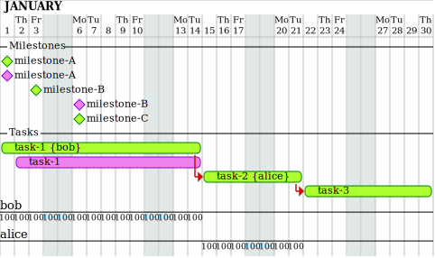

# syntax example

## code

```
project starts the 2020/1/1
saturday are closed
sunday are closed

-- milestones --
[milestone-A] as msA
[milestone-B] as msB
[milestone-C] as msC

-- tasks --
[task-1] as task1
[task-2] as task2
[task-3] as task3

-- Milestones --
msA
  >! 2020/1/1
  .! 2020/1/1
msB
  >! 2020/1/3
  .! 2020/1/4
msC
  >! 2020/1/5

-- Tasks --
task1
  >> 2020/1/1
  >= 10 days @bob
  .> 2020/1/2
  .= 9 days
task2
  >> task1's end
  >= 5 days @alice
task3
  >> task2's end
  >< 2020/1/30
```

## chart


